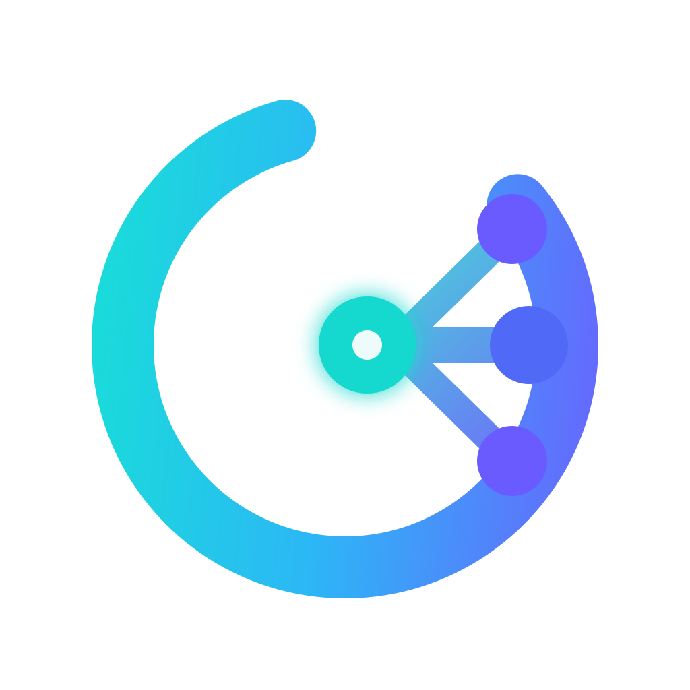

<p align="center">
  
</p>

# LibreChat + LightRAG + n8n + Postgres + MCP

A shared knowledge base stack. LibreChat provides the chat interface; LightRAG
indexes documents and retrieves evidence; the MCP bridge connects the two.
n8n provides an interface for creating automations that call LightRAG.
MongoDB is included because LibreChat requires it for users and conversations;
Postgres does not replace it.

## UI branding

Compose mounts the repository logo into LibreChat's login logo and browser
favicons, and LightRAG's workspace welcome logo (`http://localhost:9621/workspace/`
with the default port) and favicon. The mounts are read-only.
`docs/assets/logo.svg` embeds the PNG so the applications can keep their existing
SVG asset paths. This customizes the static logos; other built-in product icons
and names remain as provided by the applications.

Apply branding changes to an existing stack with:

```bash
docker compose up -d --no-deps librechat lightrag
```

Hard-refresh the browser if it has cached the previous images. LightRAG's logo
asset filename is specific to the pinned image in `compose.yaml`; check the
`/app/lightrag/api/webui/assets/logo-*.svg` path when upgrading that image.
If replacing the PNG, regenerate the SVG wrapper with the same image.

## Getting started

You need Docker Engine/Docker Desktop with Compose v2 and Python 3 on your
computer. As a starting point, allocate 8 GB of RAM and at least 15 GB of disk
space to Docker; the required space grows with images and documents. No GPU is
required for local embeddings: Ollama uses the CPU by default.

```bash
cd librechat-lightrag-stack
python3 scripts/init_env.py
```

Open `.env` and enter `CHAT_API_KEY` and `KNOWLEDGE_API_KEY`:
they can use the same key. Embeddings use Ollama in the stack with
`EMBEDDING_API_KEY=ollama` (a placeholder, not a credential). Example values
are not valid credentials. Change the models too if your account does not have
access to the ones shown. Do not share `.env`.

```bash
docker compose config --quiet
docker compose up -d --build
docker compose ps
docker compose logs --tail=100 ollama lightrag mcp librechat n8n
```

The first startup downloads images, creates the database, and downloads
`bge-m3` (about 1.2 GB) through the temporary `ollama-init` service. The model
remains in the `ollama_data` volume; `ollama-init` exits with code 0 when it
finishes. LightRAG waits for the download and must become healthy before MCP
and LibreChat start.

| Interface | URL | Access |
|---|---|---|
| LibreChat | http://localhost:3080 | Register your first account |
| LightRAG | http://localhost:9621/webui | Enter the `LIGHTRAG_API_KEY` value from your `.env` |
| n8n | http://localhost:5678 | Create the owner account on first access |

Ports are published only on `127.0.0.1`. If you run the stack on a remote
server, use an SSH tunnel to access it from your computer:

```bash
ssh -L 3080:127.0.0.1:3080 -L 9621:127.0.0.1:9621 -L 5678:127.0.0.1:5678 user@server
```

After creating the necessary accounts, you can set
`ALLOW_REGISTRATION=false` in `.env` and apply it with:

```bash
docker compose up -d librechat
```

## Ask your documents a first question

1. Open LightRAG → Documents and upload `sample-data/demo-acme.txt`.
2. Wait for the **processed** status. Uploading starts indexing, which requires
   the LLM and embedding providers.
3. In LibreChat, select the configured model, open the tools/MCP menu, and
   enable `lightrag`. Alternatively, create an Agent and assign the
   `knowledge_search` tool to its model. The model must support tool calling.
4. Ask: “Use the knowledge base: who manages the Acme Demo contract, and when
   does it expire? Cite the document.”
5. Check that the `knowledge_search` call appears. The demo evidence gives
   **Giulia Bianchi Demo**, **December 31, 2026**, and `demo-acme.txt`.

The server instructions ask the model to consult the knowledge base, but do not
require a tool call for every message: check that the tool was called. A name
such as `knowledge_search_mcp_lightrag` may be the client-assigned name for the
same tool.

Documents must be uploaded through the LightRAG WebUI. Attaching a file to a
LibreChat conversation **does not automatically add it to LightRAG**. This
stack does not include LibreChat's separate RAG API and disables its related
file search. Meilisearch is omitted, and conversation history search is
disabled.

## Product knowledge demo

The [Jira and Figma demo](sample-data/product-knowledge-demo/README.md) uses
fictional sources to explain two connected products and prepare a cross-team
initiative. It includes an unresolved design/requirement conflict, missing
policy ownership, a manual n8n ingestion workflow, and guided evaluation prompts.
See the [concept](docs/ideas/product-knowledge-demo.md) for scope and assumptions.

The [Product Knowledge agent](docs/agent-mcp-setup.md) combines LightRAG retrieval
with selected read-only Jira and Figma MCP tools. External sources require
each user's OAuth authorization; simulated demo sources use LightRAG only.
The agent provisioning script and connection steps are documented in the agent
guide. The demo workflow must be imported and executed separately; wait for
LightRAG indexing before testing the demo questions.

## n8n automations

Open `http://localhost:5678` and create the owner account. n8n stores workflows,
credentials, and its encryption key in the `n8n_data` volume; include this
volume in backups. An HTTP Request node can reach LightRAG at
`http://lightrag:9621` and authenticate with the `LIGHTRAG_API_KEY` value from
your `.env`. Put the key in n8n credentials, not in exported workflows. The
repository includes a manual workflow for searching web content with Tavily
and queuing it in LightRAG, plus a workflow for ingesting exported NotebookLM
Docs. See the [n8n guide](n8n/README.md) for importing, credentials, and use.
There are no scheduled synchronizations.

The UI is accessible only from the computer running Docker. Webhooks also
receive requests only from there until you configure an HTTPS reverse proxy
and the public n8n URL. `N8N_PORT` and `N8N_TIMEZONE` can be configured in
`.env`.

## What each service stores

| Service | Data / role | Persistence |
|---|---|---|
| LibreChat | UI, conversations, accounts, agent configuration | MongoDB; volumes for uploads, images, logs, and local data |
| LightRAG | Parsing, entity/relationship extraction, indexing, and retrieval | Postgres + volumes for inputs and working files |
| n8n | Automation workflows and credentials | `n8n_data` volume (SQLite and encryption key) |
| Postgres 17 + pgvector | Graph, vectors, chunks/documents, cache, and indexing status | `postgres_data` volume |
| MCP | Translates `knowledge_search` to `POST /query/data` | No database of its own |
| MongoDB | LibreChat application store | `mongo_data` volume |

LightRAG uses `PGKVStorage`, `PGDocStatusStorage`, `PGVectorStorage`, and
`PGTableGraphStorage`. The latter stores nodes and edges in PostgreSQL tables:
Neo4j and Apache AGE are not needed. `postgres/init.sql` enables pgvector on
first startup; LightRAG initializes its own tables.

Requests follow this path:

1. The model in LibreChat calls the MCP tool with a standalone question.
2. MCP calls LightRAG in `mix` mode, with a context budget and the API key.
3. LightRAG searches the graph and vectors and returns chunks, relationships,
   and sources.
4. The model in LibreChat receives that JSON and writes the final answer.

`/query/data` avoids a second final-answer generation by LightRAG. LightRAG may
still call an LLM to extract query keywords, in addition to using one during
indexing. Embeddings also require their provider. Searching therefore does not
mean zero API calls.

## Models and providers

Three roles are configured separately in `.env`:

- `CHAT_*`: the model that chats in LibreChat and uses MCP.
- `KNOWLEDGE_*`: the model LightRAG uses for extraction and keywords.
- `EMBEDDING_*`: the model that creates vectors, with a matching dimension.

The default embeddings use `bge-m3` on Ollama in the stack, through
`http://ollama:11434/v1`, with 1024 dimensions. Ollama does not publish ports
on the host and does not modify any Ollama installation already on your
computer. `BAAI/bge-reranker-v2-m3` is a reranker; it does not create the
embeddings this configuration requires. Reranking remains disabled.

Chat, extraction, and keywords still use OpenAI endpoints: **these calls use
external APIs**, may send text and queries to the configured providers, and
may incur a cost. To make these models local too, configure OpenAI-compatible
endpoints reachable from the containers, suitable models, and placeholder keys
if the local server requires them.

Inside a container, `localhost` refers to that container. If the provider is
another Docker service, use its network name. For a provider on the Linux host,
add `extra_hosts: ["host.docker.internal:host-gateway"]` to the services that
need to reach it; on Docker Desktop, the name is normally available.

Do not change the embedding model or dimension on an already populated index.
`LIGHTRAG_WORKSPACE=company_bge_m3` selects a new workspace; LightRAG 1.5.7
also separates vector tables by model and dimension. Documents from the old
`company` workspace do not appear automatically in the new one: reindex the
original texts. `EMBEDDING_SEND_DIM=false` and `EMBEDDING_USE_BASE64=false` make
requests compatible with Ollama.

### Migration and rollback

For an existing installation, keep the old `.env` in a Git-ignored location
and set the endpoint, placeholder key, model, dimension, and workspace as in
`.env.example`. Recreate LightRAG after verifying Ollama:

```bash
docker compose up -d ollama
docker compose run --rm ollama-init
docker compose exec ollama ollama list
docker compose up -d lightrag
docker compose exec mcp python smoke.py
```

Upload a small document and verify a search before reindexing everything.
CPU configuration does not require a GPU; indexing time depends on CPU, RAM,
and document length.

To return to the old index, restore the previous endpoint/key/model/dimension
and set `LIGHTRAG_WORKSPACE=company`, then run
`docker compose up -d lightrag`. The old `.env` may not contain the workspace;
add it explicitly. Keep the volumes; do not use `down -v`. The migration on
this machine saves the previous configuration to `backups/pre-ollama.env` and
the original texts to `backups/company-documents.json`; both remain Git-ignored
and may contain confidential data.

## Updates and writing

Uploads, removals, and administrative changes are managed in LightRAG. MCP
exposes search only: the LibreChat LLM cannot add or delete facts. There are no
preconfigured email or CRM workflows, and no scheduled synchronizations.
The repository includes a manual workflow for importing web pages and a
workflow for importing exported NotebookLM Docs through Google Drive, described in the
[n8n guide](n8n/README.md).

The configured `LIGHTRAG_WORKSPACE` (default `company_bge_m3`) is shared, and
so is the MCP key: all users assigned the tool can query the same knowledge
base. This setup does not provide per-document permissions or customer
isolation. Database credentials
are the ones initialized on first startup: changing `.env` alone after the
volumes have been created does not change the database passwords.

## Verify the connection

Without model calls, check health and the MCP protocol:

```bash
docker compose exec mcp python smoke.py
```

After indexing the demo, verify actual source retrieval (this may use LLM and
embedding APIs):

```bash
docker compose exec mcp python smoke.py "Who manages the Acme Demo contract, and when does it expire?"
```

The result should contain the demo evidence. A successful HTTP response with
empty data does not prove indexing is complete. The internal MCP test does not
verify tool selection in LibreChat: also complete the UI test.

If something does not work:

| Symptom | Check |
|---|---|
| LightRAG does not become healthy | `docker compose logs --tail=150 postgres lightrag`; check keys and storage |
| Provider error 401/403 | Correct role's API key and model access |
| MCP 401 | Same `MCP_TOKEN` in LibreChat and MCP; recreate both services after changes |
| MCP 421 | Bridge host differs from `mcp:8000`; update the allowlist in `mcp/server.py` |
| LibreChat blocks the internal URL | `mcpSettings.allowedDomains` must include `http://mcp:8000` |
| No evidence | Document is processed, workspace is correct, and the tool call actually ran |
| Registration is disabled | Temporarily re-enable `ALLOW_REGISTRATION` and recreate LibreChat |

## Persistence and backups

`docker compose down` stops the stack and keeps the volumes. Do not add `-v` if
you want to keep the data: it deletes the project volumes.

For a complete backup, safely retain `.env`, the configuration files, and all
volumes listed in `compose.yaml`. For database dumps consistent with the files,
stop the applications first:

```bash
mkdir -p backups
docker compose stop librechat mcp lightrag n8n
docker compose exec -T postgres pg_dump -U lightrag -d lightrag -Fc > backups/lightrag.dump
docker compose exec -T mongodb sh -c 'mongodump --username "$MONGO_INITDB_ROOT_USERNAME" --password "$MONGO_INITDB_ROOT_PASSWORD" --authenticationDatabase admin --archive --gzip' > backups/librechat.archive.gz
# Also save the file volumes with your Docker backup system.
docker compose start lightrag mcp librechat n8n
```

## Versions and verification

Prepared October 3, 2026. LightRAG v1.5.7, LibreChat, MongoDB 8.0.20, and
pgvector/Postgres images are pinned to the verified manifest digest. The n8n
image is pinned to version `2.0.0`; its digest was not verified in this
environment.
LibreChat uses the official `librechat-dev` channel from the upstream Compose
file, pinned to the included digest; it is not presented as a stable release.
The bridge uses MCP Python SDK 1.26.0; resolved Python dependencies are pinned
in the lock file.

The Compose file was checked against the official JSON Schema, image
references were checked, and the bridge was tested for MCP protocol,
authentication, argument limits, source preservation, and error handling. The
tests use a mocked LightRAG backend. The initial verification used static
Compose validation; later local verification ran `docker compose config`,
started the stack, and checked sample retrieval with Ollama embeddings, as
recorded in [the implementation notes](tasks/plan.md). The n8n workflows have
offline tests; their full external-provider ingestion paths still need live
verification with the required credentials.

To rerun the bridge tests without Docker:

```bash
python3 -m venv .venv
.venv/bin/pip install -r mcp/requirements.lock
.venv/bin/python -m unittest discover -s mcp/tests -v
```

## Official references

- [LightRAG API and storage, v1.5.7](https://github.com/HKUDS/LightRAG/blob/v1.5.7/docs/LightRAG-API-Server.md)
- [LightRAG environment variables, v1.5.7](https://github.com/HKUDS/LightRAG/blob/v1.5.7/env.example)
- [LightRAG query API, v1.5.7](https://github.com/HKUDS/LightRAG/blob/v1.5.7/lightrag/api/routers/query_routes.py)
- [LibreChat upstream Compose file](https://github.com/LibreChat-AI/LibreChat/blob/main/docker-compose.yml)
- [LibreChat MCP](https://www.librechat.ai/docs/configuration/librechat_yaml/object_structure/mcp_servers)
- [LibreChat MCP restrictions](https://www.librechat.ai/docs/configuration/librechat_yaml/object_structure/mcp_settings)
- [n8n self-hosting with Docker](https://docs.n8n.io/hosting/installation/docker/)
- [MCP Python SDK 1.26.0](https://github.com/modelcontextprotocol/python-sdk/tree/v1.26.0)

This bundle contains configuration and the bridge; upstream projects retain
their own licenses. Exposing it to the Internet requires a deployment with
HTTPS, domains, and access controls configured for your environment.
