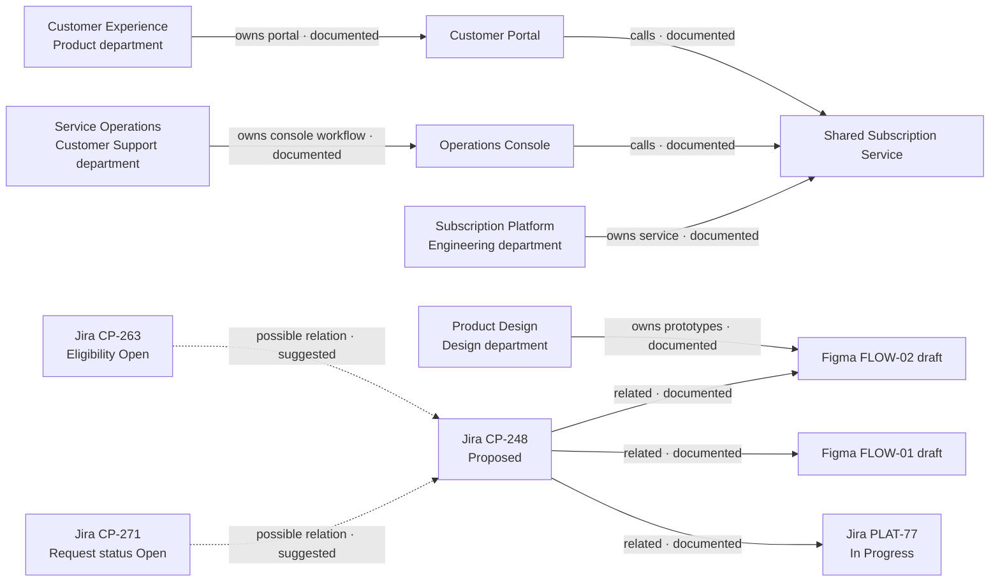

# Product knowledge assistant: demo concept

## Problem and proposal

Teams make product decisions across project tracking and design files. A person
answering a question often has to reconcile a Jira decision with a Figma
proposal, work out which statement is current, and identify missing policy
owners. This demo explores a read-only assistant that finds and explains that
evidence for the Customer Portal and Operations Console.

The fictional initiative is to let customers change their plans themselves
while giving Customer Support visibility and control. Jira and Figma material
in this demo is simulated. It illustrates source reconciliation; it is not a
native export or a connection to either service.

## Users and jobs

The four participating departments are Product, Design, Engineering, and
Customer Support. The simulated ownership context maps these departments to
the Customer Experience, Product Design, Subscription Platform, and Service
Operations teams. A team member should be able to:

- ask what is currently agreed, planned, proposed, or still unknown;
- see which source supports each statement and where sources disagree;
- identify decisions or policies that need an owner;
- request a proposed implementation plan or draft Jira tickets grounded in
  cited evidence.

## MVP scope

- Ingest the bundled, simulated Jira and Figma snapshots into LightRAG.
- Answer natural-language questions about the fictional initiative with
  citations to stable source filenames.
- Preserve status distinctions such as current, planned, draft, and approved.
- Surface conflicts, missing evidence, and uncertainty rather than resolve
  them by guessing.
- Produce suggested next steps and draft ticket text for a person to review.
- Keep all actions read-only: the assistant does not edit Jira or Figma and
  does not create tickets or change a plan.

## Out of scope

- Live Jira or Figma integrations, native exports, synchronization, or
  automatic refresh.
- Writing, publishing, assigning, or modifying tickets, designs, or plans.
- Treating suggested relationships between sources as documented facts.
- Inferring policy where no policy or accountable owner appears in the sources.
- Access control by team, project, customer, or document.
- Production readiness, deterministic answer wording, or evaluation by
  automated scoring.

## Assumptions and boundaries

The dataset is a small, hand-authored simulation designed to contain both
supporting evidence and deliberate gaps. Source filenames are stable citations
within the demo. A citation shows which snapshot supports a claim; it does not
prove that an equivalent record exists in Jira or Figma.

Jira proposes that an account owner approve a plan change, while a Figma draft
proposes applying it immediately. Neither source establishes the current
policy, so the assistant should report the conflict with both citations and
should not silently choose one. The eligibility policy owner is intentionally
unknown and must stay unknown unless a source identifies one.
Relationships that the assistant infers between artifacts must be labeled as
suggested, not documented.

The source context documents that both products call the shared Subscription
Service and identifies team ownership. Jira explicitly links CP-248 with the
two design prototypes and the service audit event ticket. The diagram labels
these source relationships as documented. Links from the eligibility and
request-status tickets to CP-248 are suggested by the evidence map, not
explicitly documented in the snapshots.

The current stack shares its LightRAG workspace and MCP key across users. Use
an isolated demo instance or workspace when practical; the current shared graph
does not provide project or document isolation. Do not mix this simulated
dataset with confidential or production documents.

## Success criteria

The demo succeeds when a reviewer can ask a useful question and judge whether
the response:

1. cites stable source filenames for factual claims;
2. distinguishes approved/current information from planned and draft material;
3. exposes the immediate-change versus approval conflict;
4. leaves the eligibility policy owner unknown;
5. separates documented relationships from suggested ones; and
6. presents any plan or ticket text as a human-reviewed draft, with no external
   writes.

Success is a human judgment over grounded behavior, not a promise of identical
answers on every run.
